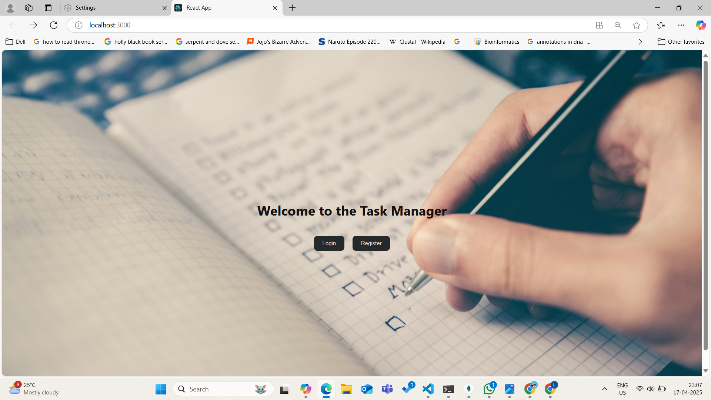
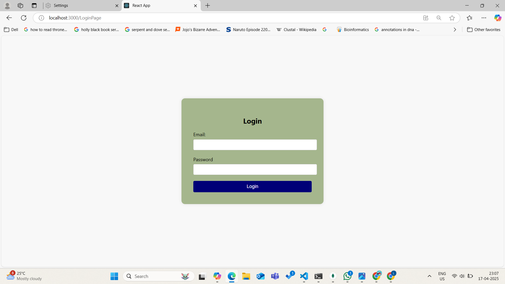
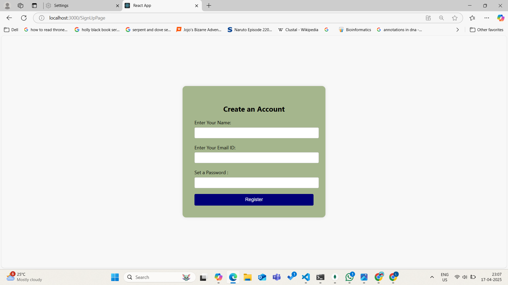
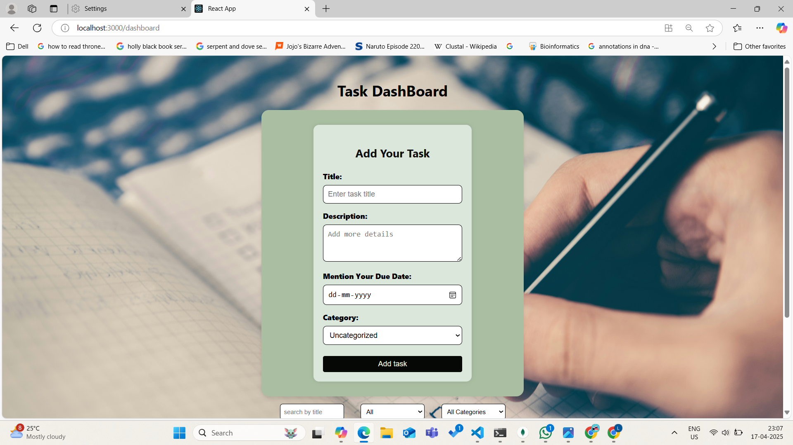

#  Task Manager App

A full-stack Task Management web application that allows users to sign up, log in, and manage tasks easily. Built using **React**, **Node.js**, **Express**, and **MongoDB**.

---

## Live Demo

[👉 Click here to view the deployed app](https://your-deployed-link.com)  
*(Replace this with your actual live site link if available)*

---

## Features

-User Authentication (Register & Login using JWT)
-Create, Read, Update, Delete (CRUD) Tasks
-Categorize tasks with tags or categories
- Mark tasks as completed or pending
- Search tasks by title
- view tasks based on if they are completed or pending


---

##  Tech Stack

### Frontend:
- React
- Axios
- React Router DOM
- Tailwind CSS / Custom CSS

### Backend:
- Node.js
- Express.js
- MongoDB (Mongoose)
- JWT (JSON Web Token)
- Bcrypt for password hashing

---

## How to Run Locally

### 1. Clone the Repository
```bash
git clone https://github.com/yourusername/Task_Manager.git
cd Task_Manager


2. Backend Setup
bash
Copy code
cd backend
npm install
Create a .env file in the backend folder and add:

ini
Copy code
PORT=5000
MONGO_URI=your_mongodb_connection_string
JWT_SECRET=your_jwt_secret
Then run:

bash
Copy code
node server.js


3. Frontend Setup
bash
Copy code
cd ../frontend
npm install
npm start
The frontend will run on http://localhost:3000
The backend will run on http://localhost:5000

🧠 Assumptions Made
Each user can only access their own tasks.
JWT is stored in localStorage for auth.
Tasks are listed by latest created by default.


🧗 Challenges Faced
Managing authentication across frontend & backend
Protecting routes using middleware
Making the UI responsive and user-friendly
Organizing components cleanly for reusability


📸 Screenshots






🙋 Contact
Built with ❤️ by Your Name
Feel free to fork, star ⭐, or reach out!


